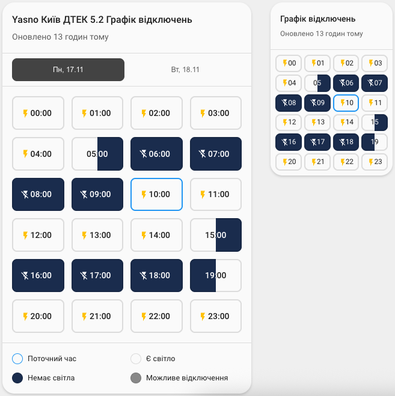
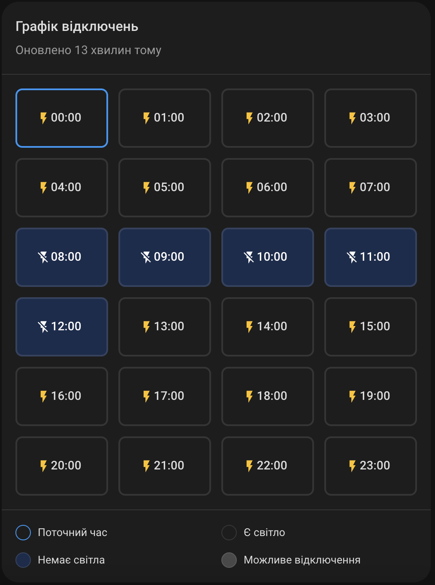

[](https://stand-with-ukraine.pp.ua)

# Yasno Outages Card

A custom Home Assistant card for visualizing 24-hour power outage schedules from the [ha-yasno-outages](https://github.com/denysdovhan/ha-yasno-outages) integration.

> **Design Inspiration**: The visual design of this card is inspired by the "Київ Цифровий" mobile app by "КП ГІОЦ", which provides a clean and intuitive way to display power outage schedules.

## Prerequisites

This card requires the [ha-yasno-outages integration](https://github.com/denysdovhan/ha-yasno-outages) to be installed and configured in your Home Assistant instance. The integration provides calendar entities with power outage schedule data from Yasno.

## Features

- **24-Hour Grid View**: Displays each hour of the day as individual "bricks"
- **Three Power States**:
  - **Powered**: No outage expected
  - **Certain Outage**: Power will definitely be cut
  - **Possible Outage**: Power might be cut
- **Partial Hour Support**: Shows vertical splits when outages start/end mid-hour
- **Versatile Title/Subtitle**: Configure using strings, templates, or arrays of content items (entity, device, area, state, attributes, custom text)
- **Visual Editor**: Chip-based interface for configuring title/subtitle (same as Home Assistant's tile card)
- **Auto-updating Timestamps**: Relative time display for timestamp sensors with automatic updates
- **Template Support**: Use Jinja2 templates with reactive updates
- **Responsive Design**: Works on all device sizes
- **Legend**: Visual guide for understanding the states

## Installation

### HACS (Recommended)

1. Open HACS in your Home Assistant instance
2. Go to "Frontend" section
3. Click the menu (three dots) in the top right
4. Select "Custom repositories"
5. Add this repository URL: `https://github.com/klevytskyi/ha-yasno-outages-card`
6. Select category: "Lovelace"
7. Click "Add"
8. Find "Yasno Outages Card" in HACS and install it
9. Restart Home Assistant

### Manual Installation

1. Download `yasno-outages-card.js` from the [latest release](https://github.com/klevytskyi/ha-yasno-outages-card/releases)
2. Copy the file to your `config/www` folder (create it if it doesn't exist)
3. Add the resource to your Lovelace configuration:

   **Via UI**: Configuration → Dashboards → Resources → Add Resource

   - URL: `/local/yasno-outages-card.js`
   - Type: JavaScript Module

   **Via YAML** in `configuration.yaml`:

   ```yaml
   lovelace:
     resources:
       - url: /local/yasno-outages-card.js
         type: module
   ```

4. Refresh your browser (hard refresh: Ctrl+Shift+R / Cmd+Shift+R)

## Configuration

### Minimal Configuration

```yaml
- type: custom:yasno-outages-card
  entity: calendar.yasno_power_outages
```

### Basic Configuration

```yaml
- type: custom:yasno-outages-card
  entity: calendar.yasno_power_outages
  title: "Power Schedule"
  subtitle: "Today's outages"
```

### With Templates

```yaml
- type: custom:yasno-outages-card
  entity: calendar.yasno_power_outages
  title: "{{ state_attr('calendar.yasno_power_outages', 'friendly_name') }}"
  subtitle: "{{ now().strftime('%A, %d %B %Y') }}"
```

### With Timestamp Sensor (Auto-updating)

```yaml
- type: custom:yasno-outages-card
  entity: calendar.yasno_power_outages
  title: "Power Outages"
  subtitle_entity: sensor.yasno_last_updated
  subtitle:
    type: state # Shows "20 годин тому" with auto-update
```

### With Content Items

```yaml
- type: custom:yasno-outages-card
  entity: calendar.yasno_power_outages
  title:
    - type: area # "Living Room"
    - type: text
      text: "-"
    - type: entity # "Yasno Power Outages"
  subtitle_entity: sensor.yasno_last_updated
  subtitle:
    - type: text
      text: "Оновлено"
    - type: state # "20 годин тому"
```

See the examples directory for more configuration samples.

## Screenshots

### Light Theme


### Dark Theme


## Compatibility

- **Home Assistant**: 2024.1.0 or newer
- **Required Integration**: [ha-yasno-outages](https://github.com/denysdovhan/ha-yasno-outages)
- **Browsers**: All modern browsers supporting ES2020

## Contributing

Contributions are welcome! Please feel free to submit a Pull Request.

## Development

See [BUILD.md](BUILD.md) and [DEVELOPMENT.md](DEVELOPMENT.md) for development instructions.

## License

MIT License - See [LICENSE](LICENSE) file for details.

## Credits

- Design inspired by "Київ Цифровий" app by "КП ГІОЦ"
- Data provided by [ha-yasno-outages integration](https://github.com/denysdovhan/ha-yasno-outages)

## Support

- For card issues: [Open an issue](https://github.com/klevytskyi/ha-yasno-outages-card/issues)
- For integration issues: [ha-yasno-outages issues](https://github.com/denysdovhan/ha-yasno-outages/issues)
- [Home Assistant Community Forum](https://community.home-assistant.io/)
